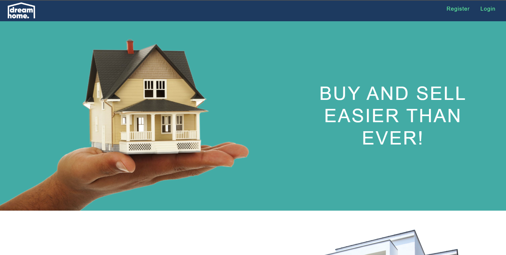
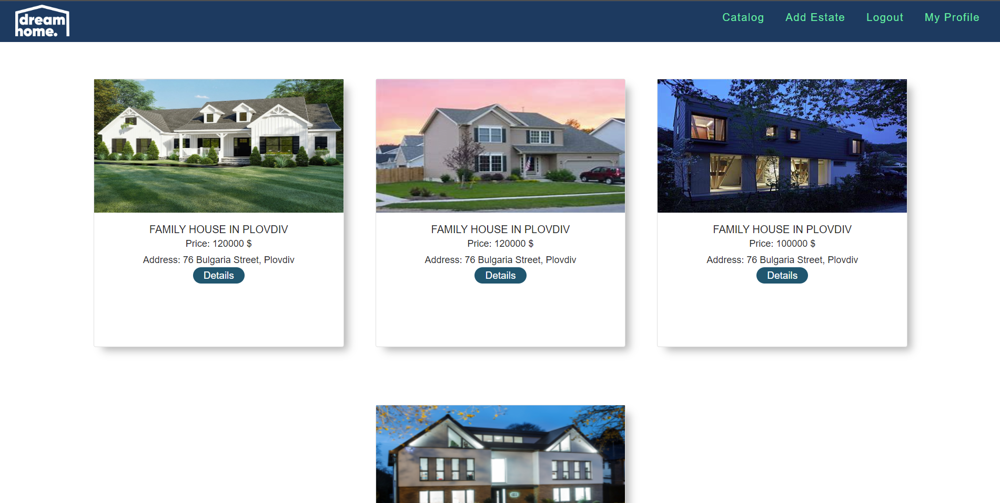
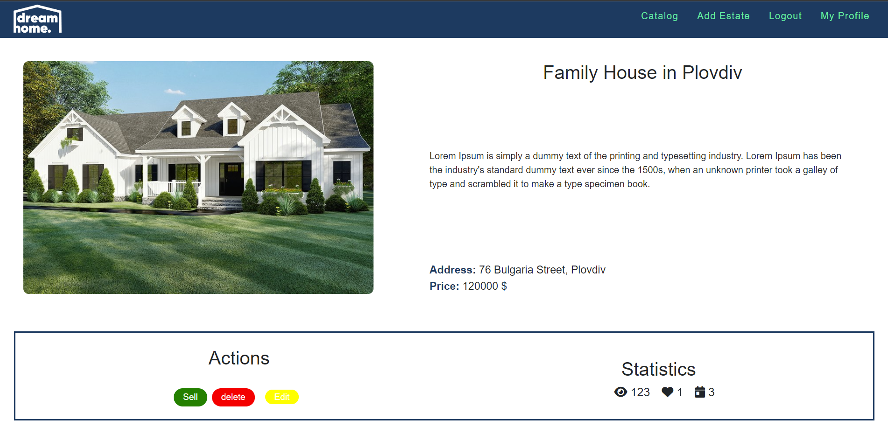
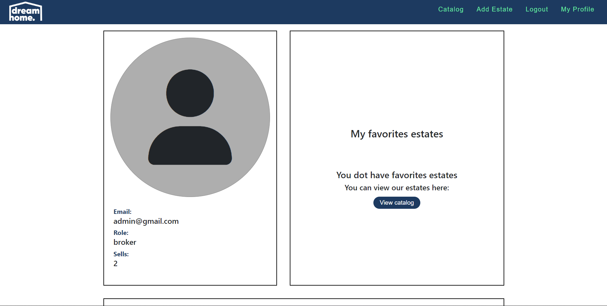

dream home is a web application created for the sale and purchase of real estate.
This is my defense project for Angular Course at SoftUni. (Mar-Apr 2022)

 
# :pencil2: Overview 
 Dream Home is a web application that connects brokers with estates buyers and makes their contact easy. It has the following functionality:

 ### Guest Users can:
  * see the welcome page.
  * see the estate catalog page.
  * create profile from the register page.
 ### Logged buyers can:
  * like and dislike estates.
  * book an appointment for viewing.
  * see their profile page.
 ### Logged brokers can:
  * like and dislike estates.
  * book an appointment for viewing.
  * see their profile page.
  * create new estates.
  * edit estates.
  * delete estates.
  * sell estates.
  * see the statistics.

# :hammer: Build With JavaScript
 - Angular
 - node.js
 - RxJS: library for reactive programming using Observables
 - Routing
 - Authentication
 - Reactive Forms
 - Dependency Injection

# Screenshots

## Home Page

## Catalog Page

## Details Page

## Edit Page

## My Profile Page
